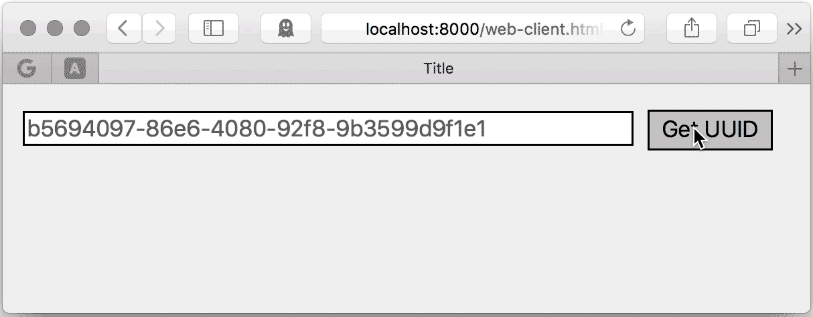

Quick start
===========

Let's try to write simple http server with WSRPC handler.

.. literalinclude:: examples/main/server.py
   :language: python

Next you have two options:

    1. Browser WSRPC client.
    2. Python WSRPC client.

Browser client
~~~~~~~~~~~~~~

.. literalinclude:: examples/main/web-client.html
   :language: html

You can try it on http://localhost:8000/web-client.html (required running server.py).

Python client
~~~~~~~~~~~~~

.. literalinclude:: examples/main/client.py
   :language: python

This is so useful for testing and shell scripts for your services.

How it works
++++++++++++

The following sequence diagram probably to explain some high level of the data-flow.

.. uml:: explanation.puml
